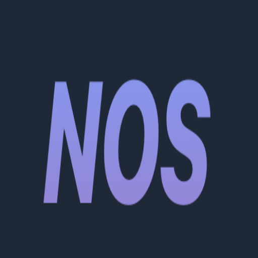
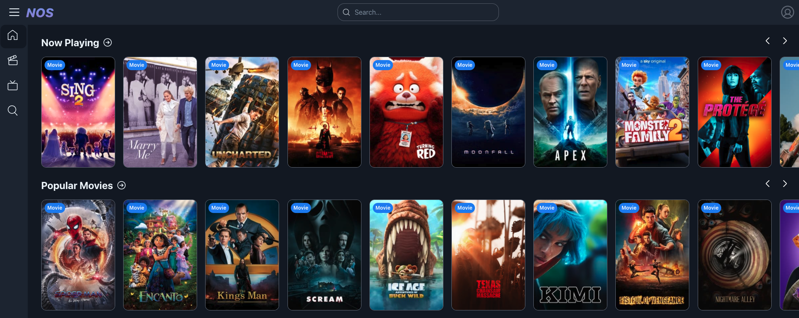

# ⚡️ NOS - Streaming Movies & TV Shows [](https://github.com/facebook/create-react-app/blob/main/CONTRIBUTING.md)



Responsive movies and tv show application buit with...

- [NextJS](https://github.com/vercel/next.js) – React Framework...
- [Chakra UI ](https://github.com/chakra-ui/chakra-ui) – Chakra UI provides a set of accessible, reusable, and composable React components...
- [Prisma](https://github.com/prisma/prisma) - Prisma is a next-generation ORM with PostgreSQL

## Quick Overview

---

```sh
git clone https://github.com/hamidihekmat/nos-ui.git
cd nos-ui
yarn dev
# or
npm run dev
```

# Example




Deploy it to the cloud [view demo](https://nos.hekmathamidi.me/)

# Reflection

The goal of this project was to get comfortable with Typescript and UI component library...

What I learned....

- Fimilarized myself with `Typescript`, `Styled Components` & `CSS`
- Learned about `NextJS` image optimization and `SWR` caching
- Created resuable components to reduce code duplication
- Designed `responsive` UI layouts
- Created multiple custom hooks e.g `Intersection Observer` Hook for infinite scrolling
